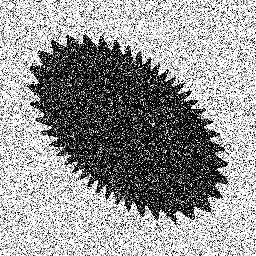

# MAP512_Segmentation
Theses are codes for a short project during a class MAP512 at Ecole polytechnique. 2019, Second term

## Random Walker
```Random walker``` algorithm is included in the directory **random_walker**, one can test the algorithm with the script **test.py**

## AtlasNet by transfer learning


## Data generator
At the same time, one can find the data-generator in the file **ImgGenerator.py**. It will create images like

<div align="center">
    
</div>
We can absolutely change the standard deviation (scale of the gaussian noise) and the number of shape deformation in the code


